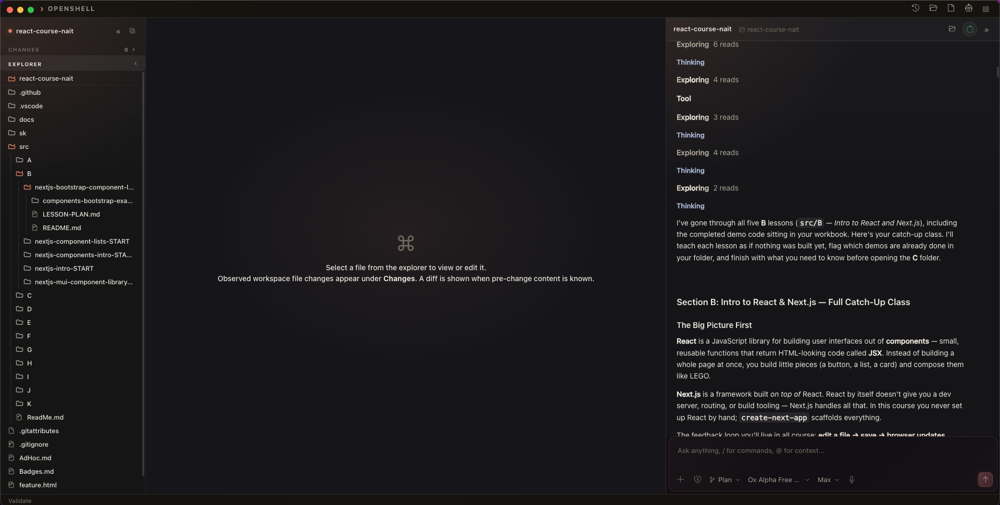
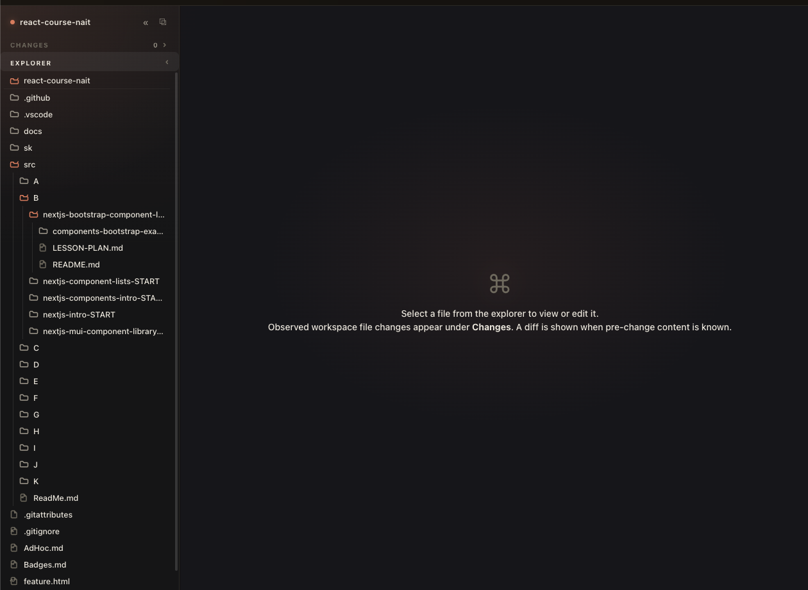
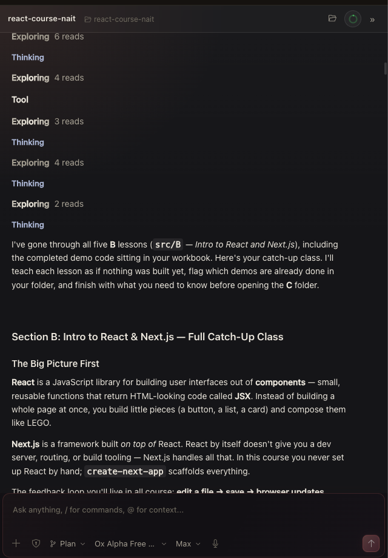

# OpenShell

**See your coding agent work.**

OpenShell is a desktop workspace for [OpenCode](https://opencode.ai/v2). Open
your project, describe a task, and watch the agent explore, edit, and explain
its work in the same place where you review the code.

<p align="center">
  
</p>

## The Short Version

| OpenShell gives you | Why it matters |
| --- | --- |
| Live agent timeline | See exploration, reasoning, tools, subagents, and answers as they happen. |
| Real file explorer and editor | Work directly in your repository instead of a detached chat window. |
| Changes and focused diffs | Know which files changed and review the result before you keep it. |
| Integrated terminal | Run commands without leaving the workspace. |
| Sessions and workspaces | Reopen previous work and switch projects quickly. |
| Model and agent controls | Choose the agent, model, strength, permissions, and follow-up behavior. |

<table>
  <tr>
    <td align="center"><strong>Explore and edit the project</strong><br></td>
    <td align="center"><strong>Follow the agent in real time</strong><br></td>
  </tr>
</table>

## What It Is About

AI coding is most useful when it is fast **and** inspectable. OpenShell keeps
the conversation, the working files, and the review surface together. You can
let an agent move quickly while still seeing what it is doing, approving
permissions, interrupting a run, editing the result yourself, and checking
the final diff.

OpenShell is for developers, designers, and technical teams who want an
agent-assisted workflow that feels like a real desktop development tool rather
than a chat box with a file upload.

## A Typical Session

1. Choose **Open a folder** on the Welcome screen, or open a single file.
2. Describe the change in the prompt box. Attach files or reference project
   files with `@` when useful.
3. Watch the agent inspect the repository and stream its progress.
4. Open changed files from **Changes** and switch to **Diff** to review them.
5. Ask for refinements, edit directly, validate HTML/CSS, run a terminal
   command, or stop the session.

## Highlights

- Real-time streaming responses with readable activity, tool, subagent, todo,
  and permission entries.
- Monaco editor with tabs, autosave, word wrap, Emmet, drag-and-drop files, and
  Edit/Diff modes.
- File changes observed from the agent or outside edits, with known baselines
  shown as diffs.
- Recent session history, saved workspaces, and concurrent model panels.
- Integrated terminal and durable recovery for interrupted saves and renames.
- W3C HTML and CSS validation shown directly in the editor.
- Local Electron desktop app that opens projects from your machine and connects
  to the local OpenCode service.

## Getting Started

### Requirements

- macOS, Linux, or Windows
- Node 22.23.2 or later within the Node 22 release line
- [`opencode2`](https://opencode.ai/v2) on your `PATH`, or an OpenCode service
  already running

### Run From Source

```sh
git clone https://github.com/Tsohnle95/OpenShell.git
cd OpenShell
npm install
npm run dev
```

OpenShell discovers the OpenCode service and starts it automatically when
needed. Select **Open a folder** when the app opens.

### Install As A macOS App

```sh
npm install
npm run pack
```

This creates `release/mac/OpenShell.app`. You can also use **Install app** on
the Welcome screen to put `OpenShell.app` in `/Applications`.

## Development

```sh
npm run dev          # Electron + React development mode
npm test             # unit and component tests
npm run check        # typecheck, tests, docs check, and production compile
npm run build        # compile and launch the production app
```

OpenShell is an Electron + React + Monaco client. See the [architecture guide](docs/architecture.md)
for the implementation overview and [operations guide](docs/operations.md)
for troubleshooting.

## Documentation

- [Architecture](docs/architecture.md)
- [Walkthrough](docs/walkthrough.md)
- [Events](docs/events.md)
- [Renderer guide](docs/renderer.md)
- [Main process guide](docs/main.md)
- [Preload and shared types](docs/preload.md)
- [Product landing page](landing.html)

## Roadmap

Open requests and working items are tracked in [`TODO.md`](TODO.md).

## License

OpenShell is currently private software under active development.
